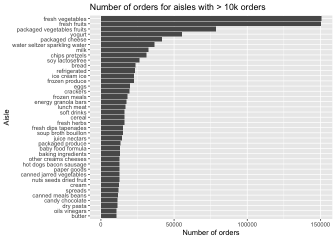
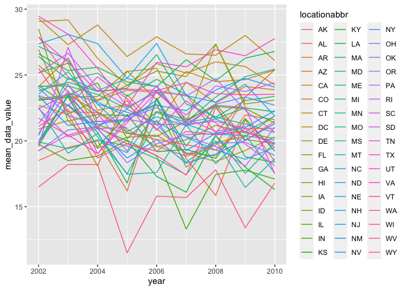
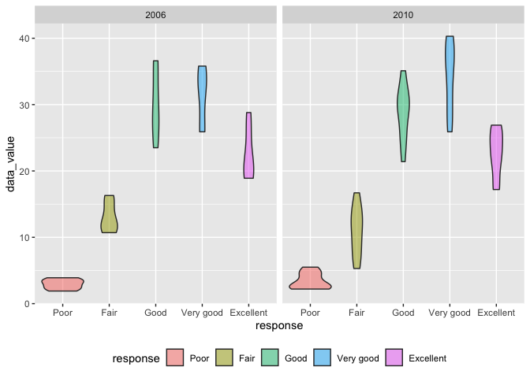
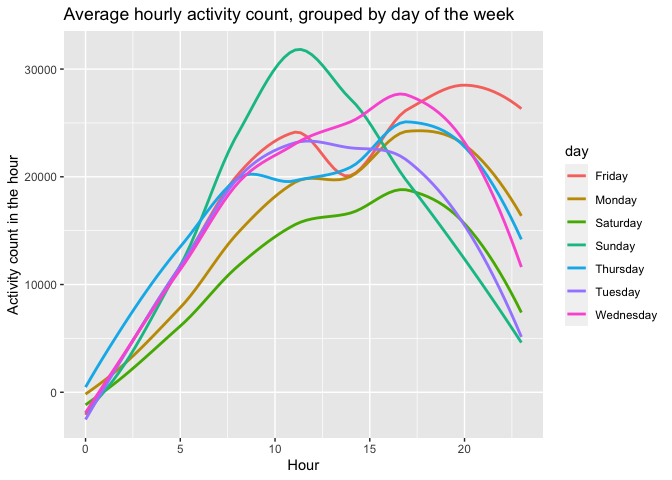

p8105_hw3_hw2851
================

## Problem 1

``` r
instacart
```

    ## # A tibble: 1,384,617 × 15
    ##    order_id product_id add_to_cart_order reordered user_id eval_set order_number
    ##       <int>      <int>             <int>     <int>   <int> <chr>           <int>
    ##  1        1      49302                 1         1  112108 train               4
    ##  2        1      11109                 2         1  112108 train               4
    ##  3        1      10246                 3         0  112108 train               4
    ##  4        1      49683                 4         0  112108 train               4
    ##  5        1      43633                 5         1  112108 train               4
    ##  6        1      13176                 6         0  112108 train               4
    ##  7        1      47209                 7         0  112108 train               4
    ##  8        1      22035                 8         1  112108 train               4
    ##  9       36      39612                 1         0   79431 train              23
    ## 10       36      19660                 2         1   79431 train              23
    ## # … with 1,384,607 more rows, and 8 more variables: order_dow <int>,
    ## #   order_hour_of_day <int>, days_since_prior_order <int>, product_name <chr>,
    ## #   aisle_id <int>, department_id <int>, aisle <chr>, department <chr>

Let’s first get an overview of the dataset. The instacart dataset has
1384617 rows. It contains 15 columns: order_id, product_id,
add_to_cart_order, reordered, user_id, eval_set, order_number,
order_dow, order_hour_of_day, days_since_prior_order, product_name,
aisle_id, department_id, aisle, department. Here is the first row of the
dataset: 1, 49302, 1, 1, 112108, train, 4, 4, 10, 9, Bulgarian Yogurt,
120, 16, yogurt, dairy eggs. Here is the last row of the dataset:
3421070, 4724, 3, 1, 139822, train, 15, 6, 10, 8, Broccoli Florettes,
32, 4, packaged produce, produce. The table below shows some statistics
of the key variables: the number of orders, the number of products,
average number of products added to an order, the number of aisles and
the number of departments.

``` r
instacart %>%
  summarize(
    n_order_id = n_distinct(order_id),
    n_product_id = n_distinct(product_id),
    avg_add_to_cart_order = mean(add_to_cart_order),
    n_aisle_id = n_distinct(aisle),
    n_department = n_distinct(department_id),
  ) %>%
  knitr::kable()
```

| n_order_id | n_product_id | avg_add_to_cart_order | n_aisle_id | n_department |
|-----------:|-------------:|----------------------:|-----------:|-------------:|
|     131209 |        39123 |              8.758044 |        134 |           21 |

How many aisles are there, and which aisles are the most items ordered
from?

There are 134 aisles. The aisles which the most orders are:

``` r
instacart %>%
  count(aisle, name='n_orders') %>%
  filter(min_rank(desc(n_orders)) < 10) %>%
  arrange(desc(n_orders)) %>%
  knitr::kable()
```

| aisle                         | n_orders |
|:------------------------------|---------:|
| fresh vegetables              |   150609 |
| fresh fruits                  |   150473 |
| packaged vegetables fruits    |    78493 |
| yogurt                        |    55240 |
| packaged cheese               |    41699 |
| water seltzer sparkling water |    36617 |
| milk                          |    32644 |
| chips pretzels                |    31269 |
| soy lactosefree               |    26240 |

``` r
instacart_popular_aisles =
instacart %>%
  count(aisle, name='n_orders') %>%
  filter(n_orders > 10000)

ggplot(instacart_popular_aisles, aes(x = reorder(aisle, n_orders), y = n_orders)) +
  coord_flip() +
  geom_col(position = "dodge") +
  labs(
    title = "Number of orders for aisles with > 10k orders",
    x = "Aisle",
    y = "Number of orders"
  )
```

<!-- --> The
plot above shows the number of orders for each aisle that have more than
10000 items ordered. There are 39 aisles with more than 10,000 orders.
The aisles with the most numbers of orders are fresh vegetable and fresh
fruits. They have more than 15k orders and excessively over other
aisles.

``` r
instacart %>%
  filter(aisle == c("baking ingredients", "dog food care", "packaged vegetables fruits")) %>%
  count(aisle, product_name, name="n_orders") %>%
  group_by(aisle) %>%
  filter(rank(desc(n_orders)) <= 3.0) %>%
  arrange(aisle, n_orders)
```

    ## # A tibble: 9 × 3
    ## # Groups:   aisle [3]
    ##   aisle                      product_name                               n_orders
    ##   <chr>                      <chr>                                         <int>
    ## 1 baking ingredients         Organic Vanilla Extract                         122
    ## 2 baking ingredients         Pure Baking Soda                                140
    ## 3 baking ingredients         Light Brown Sugar                               157
    ## 4 dog food care              Original Dry Dog                                  9
    ## 5 dog food care              Organix Chicken & Brown Rice Recipe              13
    ## 6 dog food care              Organix Grain Free Chicken & Vegetable Do…       14
    ## 7 packaged vegetables fruits Organic Blueberries                            1692
    ## 8 packaged vegetables fruits Organic Raspberries                            1920
    ## 9 packaged vegetables fruits Organic Baby Spinach                           3324

``` r
instacart %>%
  filter(product_name %in% c("Pink Lady Apples", "Coffee Ice Cream")) %>%
  group_by(product_name, order_dow) %>%
  summarize(mean_order_hour_of_day = mean(order_hour_of_day, digit=2)) %>%
  pivot_wider(names_from=order_dow, values_from=mean_order_hour_of_day) %>%
  knitr::kable(digits = 1)
```

| product_name     |    0 |    1 |    2 |    3 |    4 |    5 |    6 |
|:-----------------|-----:|-----:|-----:|-----:|-----:|-----:|-----:|
| Coffee Ice Cream | 13.8 | 14.3 | 15.4 | 15.3 | 15.2 | 12.3 | 13.8 |
| Pink Lady Apples | 13.4 | 11.4 | 11.7 | 14.2 | 11.6 | 12.8 | 11.9 |

## Problem 2

``` r
brfss_smart2010_clean =
brfss_smart2010 %>%
  # clean column names
  janitor::clean_names() %>%
  # only take "Overall Health" topic
  filter(topic == "Overall Health") %>%
  # make response a factor
  mutate(response = forcats::fct_relevel(response, c("Poor", "Fair", "Good", "Very good", "Excellent"))) %>%
  arrange(response)
brfss_smart2010_clean
```

    ## # A tibble: 10,625 × 23
    ##     year locationabbr locationdesc  class  topic  question  response sample_size
    ##    <int> <chr>        <chr>         <chr>  <chr>  <chr>     <fct>          <int>
    ##  1  2010 AL           AL - Jeffers… Healt… Overa… How is y… Poor              45
    ##  2  2010 AL           AL - Mobile … Healt… Overa… How is y… Poor              66
    ##  3  2010 AL           AL - Tuscalo… Healt… Overa… How is y… Poor              35
    ##  4  2010 AZ           AZ - Maricop… Healt… Overa… How is y… Poor              62
    ##  5  2010 AZ           AZ - Pima Co… Healt… Overa… How is y… Poor              49
    ##  6  2010 AZ           AZ - Pinal C… Healt… Overa… How is y… Poor              30
    ##  7  2010 AR           AR - Benton … Healt… Overa… How is y… Poor              21
    ##  8  2010 AR           AR - Pulaski… Healt… Overa… How is y… Poor              36
    ##  9  2010 AR           AR - Washing… Healt… Overa… How is y… Poor              16
    ## 10  2010 CA           CA - Alameda… Healt… Overa… How is y… Poor              23
    ## # … with 10,615 more rows, and 15 more variables: data_value <dbl>,
    ## #   confidence_limit_low <dbl>, confidence_limit_high <dbl>,
    ## #   display_order <int>, data_value_unit <chr>, data_value_type <chr>,
    ## #   data_value_footnote_symbol <chr>, data_value_footnote <chr>,
    ## #   data_source <chr>, class_id <chr>, topic_id <chr>, location_id <chr>,
    ## #   question_id <chr>, respid <chr>, geo_location <chr>

``` r
observed2002=
 brfss_smart2010_clean %>%
  filter(year == 2002) %>%
  group_by(locationabbr) %>%
  summarize(n_locations = n_distinct(locationdesc)) %>%
  filter(n_locations >= 7)
```

In 2002, there are 6 states that observed at 7 more locations including
CT, FL, MA, NC, NJ, PA

``` r
observed2010=
 brfss_smart2010_clean %>%
  filter(year == 2010) %>%
  group_by(locationabbr) %>%
  summarize(n_locations = n_distinct(locationdesc)) %>%
  filter(n_locations >= 7)
```

In 2010, there are 14 states that observed at 7 more locations including
CA, CO, FL, MA, MD, NC, NE, NJ, NY, OH, PA, SC, TX, WA

    ## `summarise()` has grouped output by 'year'. You can override using the `.groups` argument.

    ## Warning: Removed 3 row(s) containing missing values (geom_path).

<!-- -->

``` r
brfss_smart2010_clean %>%
  filter(locationabbr == "NY", year %in% c(2006, 2010)) %>%
  ggplot(aes(x = response, y = data_value)) +
  geom_violin(aes(fill = response), alpha = .5) +
  facet_grid(~year) +
  theme(legend.position = "bottom")
```

<!-- -->

## Problem 3

``` r
accel_data = read_csv('./data/accel_data.csv')%>%
  mutate(is_weekend = (day %in% c("Saturday", "Sunday"))) %>%
  pivot_longer(activity.1:activity.1440, names_to = "minute_of_day", names_prefix = "activity.", values_to = "activity_count") %>%
  mutate(minute_of_day = as.integer(minute_of_day))
```

There are 6 variables exist,including`colnames(accel_data)`, and
total50400 observations. Here is the first observation of the dataset:
1, 1, Friday, FALSE, 1, 88.3777778.

``` r
accel_data %>%
  group_by(day_id) %>%
  summarize(total_activity = sum(activity_count)) %>%
  knitr::kable()
```

| day_id | total_activity |
|-------:|---------------:|
|      1 |      480542.62 |
|      2 |       78828.07 |
|      3 |      376254.00 |
|      4 |      631105.00 |
|      5 |      355923.64 |
|      6 |      307094.24 |
|      7 |      340115.01 |
|      8 |      568839.00 |
|      9 |      295431.00 |
|     10 |      607175.00 |
|     11 |      422018.00 |
|     12 |      474048.00 |
|     13 |      423245.00 |
|     14 |      440962.00 |
|     15 |      467420.00 |
|     16 |      685910.00 |
|     17 |      382928.00 |
|     18 |      467052.00 |
|     19 |      371230.00 |
|     20 |      381507.00 |
|     21 |      468869.00 |
|     22 |      154049.00 |
|     23 |      409450.00 |
|     24 |        1440.00 |
|     25 |      260617.00 |
|     26 |      340291.00 |
|     27 |      319568.00 |
|     28 |      434460.00 |
|     29 |      620860.00 |
|     30 |      389080.00 |
|     31 |        1440.00 |
|     32 |      138421.00 |
|     33 |      549658.00 |
|     34 |      367824.00 |
|     35 |      445366.00 |

There is no any trends apparent was observed in this table. The
activities looks stable from the begining to the end. There are two
outliers in this dataset, they are data from day 24 and day 31. They
should be excluded during analysis.

``` r
accel_data %>%
  mutate(hour = ( minute_of_day - 1) %/% 60) %>%
  group_by(day_id, day, hour) %>%
  # get per hour activity
  summarize(hour_activity = sum(activity_count) ) %>%
  group_by(day, hour) %>%
  # get average per hour activity by day of week
  summarize(mean_hour_activity = mean(hour_activity) ) %>%
  ggplot(aes(x = hour, y = mean_hour_activity, color = day)) +
  geom_smooth(se = FALSE) +
  labs(
    title = "Average hourly activity count, grouped by day of the week",
    x = "Hour",
    y = "Activity count in the hour"
  )
```

<!-- -->

This person have a lower activity at the morning and the night, in the
hour 0, the mean of activities nearly at 0, as the time goes by, the
mean of activities keep increasing and achieve the maximum in the
afternoon and then then decreasing. There is one exception, the mean of
the activity of Friday increases until hour 11 and then decreases for
two hours , then keep increasing until hour 20.
